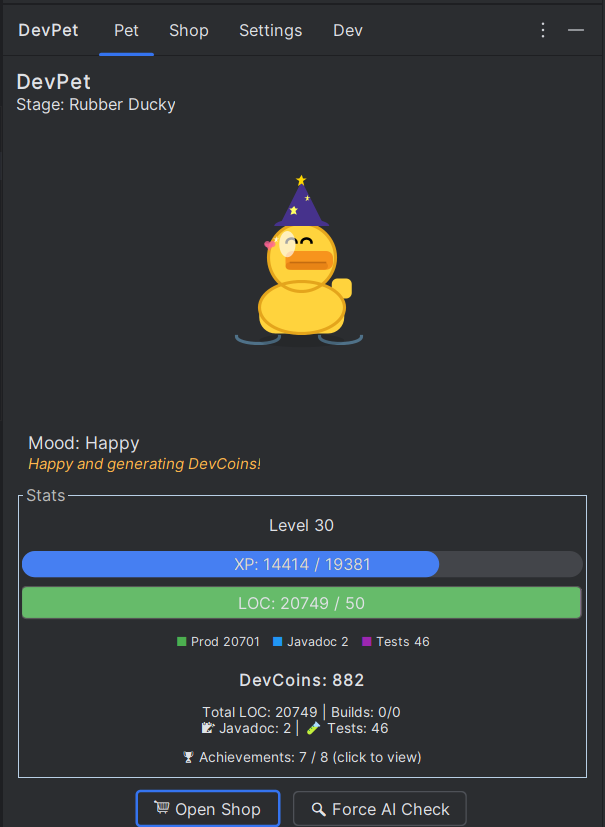
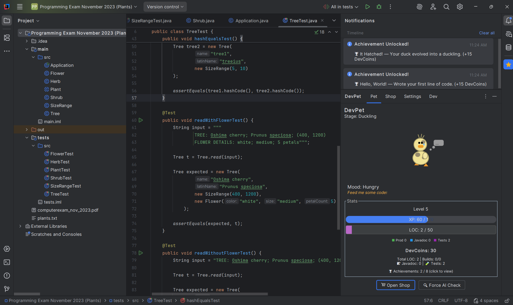
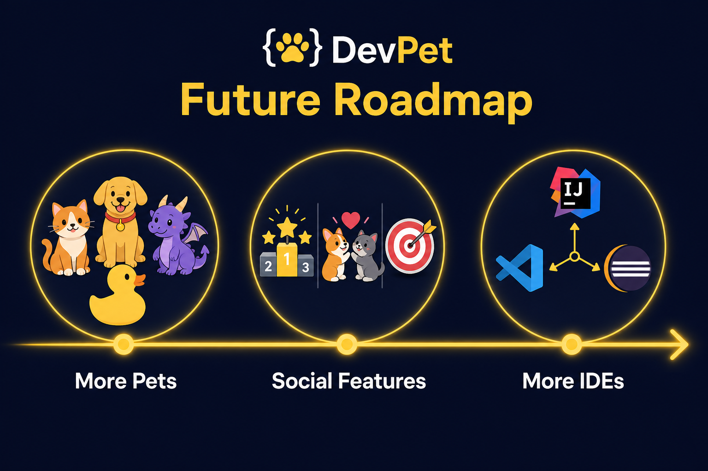

# DevPet - Your Gamified IDE Companion

### Nurturing better coding habits, one line at a time.

---

## The Problem

- **Developer Burnout:** Coding can be a grind. Staring at screens all day leads to fatigue.
- **Poor Habits:** Developers often neglect writing tests and Javadocs.
- **The AI/Copy-Paste Trap:** Blindly pasting code or over-relying on AI can lead to unverified, buggy code.

<!--
Speaker Notes:
Let's talk about the problem. Software development can be a real grind, often leading to burnout.
When we're tired, we tend to skip writing tests and documentation. On top of that, with the rise
of AI tools, it's incredibly easy to fall into the copy-paste trap.
-->

<!--
Visual: Split screen showing a tired developer and messy, undocumented AI-generated code.
-->

---

## The Solution

- **Introducing DevPet:** A virtual pet that lives right inside your IntelliJ Tool Window.
- **Core Concept:** Your pet grows and thrives based on your actual coding activity. It turns the daily grind into a rewarding, gamified experience.

---

## Key Features (The Mechanics)

- **Evolution:** Egg → Duckling → Duck → Rubber Ducky.
- **Daily Goals:** Set a daily LOC quota to keep your pet happy.
- **Quality over Quantity:** Tests and Javadocs earn higher XP multipliers.
- **Sickness Mechanic:** AI-heavy or messy code lowers health; write genuine code to recover.

---

## Gamification & Economy

- **DevCoins:** Meeting your daily quota generates passive DevCoins over time.
- **The Shop:** Spend coins on cosmetics — party hats, wizard hats, and backgrounds (Space, Forest, Ocean).
- **Achievements:** Unlock badges like "Centurion", "Build Master", and "Rubber Ducky".

---

## Demo Time

- Typing code -> XP bar fills up.
- Pasting code -> Pet gets sick.
- Successful build -> Pet eats code and poops artifacts.
- Buying and equipping a cosmetic item.

<!--
Speaker Notes:
Let's see it in action! Typing fills the XP bar. Pasting makes the pet sick.
A successful build triggers the animation. Then buy a new hat from the shop.
-->

<!--
Visual: Live demo or short video clip.
-->

---

## The Value Proposition

- **For Developers:** Makes coding fun again, provides micro-breaks, and gives a sense of daily accomplishment.
- **For Teams/Companies:** Subtly incentivizes best practices (tests, docs) and discourages mindless copy-pasting.

<!--
Speaker Notes:
For developers, DevPet brings joy back to coding. For teams, it incentivizes tests and docs
while discouraging mindless copy-pasting.
-->

<!--
Visual: Happy developer icon and team/chart icon.
-->

---

## Future Roadmap

- **More Pets:** Cats, dogs, dragons.
- **Social Features:** Team leaderboards, pet playdates, or co-op daily goals.
- **More IDEs:** Expanding beyond IntelliJ to VS Code, Eclipse, etc.

---

## Conclusion & Q&A

**Call to Action:** Download DevPet today and hatch your first egg!

**GitHub:** github.com/Alttrex/HackDelftChallenge

**Questions?**

<!--
Speaker Notes:
Thank you for your time! Download DevPet today, hatch your first egg, and start building better habits.
We're now open for any questions you might have.
-->

<!--
Visual: Rubber Ducky waving goodbye, alongside a QR code or link to the repository.
-->
